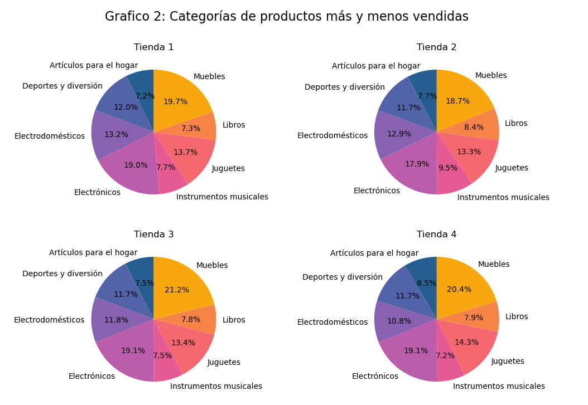

# Alura Store - Análisis de Datos

## Propósito del Análisis
El objetivo principal de este proyecto es analizar los datos de ventas de la tienda Alura Store para identificar patrones, tendencias y oportunidades de mejora. A través de este análisis, buscamos obtener insights valiosos que puedan apoyar la toma de decisiones para decidir la venta de una de las 4 tiendas

## Estructura del Proyecto
El proyecto está organizado de la siguiente manera:

```
/Challenge Alura Store
│
├── Obtencion de los datos  
│
├── notebooks/
│   ├── analysis.ipynb      # notebook con los graficos y codigo
│
├── Analisis e interpretación de los graficos
│   ├── Conclusion          
│   ├── Decision       
│
└── README.md               # Documentación del proyecto
```

## Ejemplos de Gráficos e Insights
A continuación, algunos ejemplos de los resultados obtenidos:

- **Gráfico de Ventas por Categoría**: Identificamos que la categoría "Electrónica" representa el 40% de las ventas totales.



## Instrucciones para Ejecutar el Notebook
1. Clona este repositorio en tu máquina local:
git clone https://github.com/tu-usuario/alura-store.git

2. Asegúrate de tener instalado Python 3 y las dependencias necesarias. Puedes instalarlas con:
    pip install -r requirements.txt
3. Navega al directorio `notebooks` y abre el archivo `AluraStoreLatam.ipynb` con Jupyter Notebook:

4. Ejecuta las celdas del notebook para reproducir el análisis y generar los gráficos.

¡Gracias por explorar este proyecto!